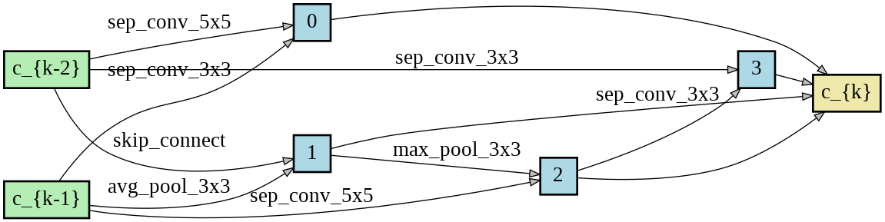

# Neural Architecture Search using Progressive Evolution

**This code is based on the implementation of [DARTS](https://github.com/quark0/darts) and [AutoDL-Projects](https://github.com/D-X-Y/AutoDL-Projects).**

## Requirements
```
Python >= 3.6.9, PyTorch >= 1.7.1, torchvision == 0.8.2
```

## Introduction
This repository contains the code for our work called Neural Architecture Search using Progressive Evolution (pEvoNAS).
In this work, we propose a method called pEvoNAS wherein the whole neural architecture search space is progressively reduced to
smaller search space regions with good architectures. This is achieved by using a trained supernet for architecture evaluation during the architecture
search using genetic algorithm to find search space regions with good architectures. Upon reaching the final reduced search space, the supernet
is then used to search for the best architecture in that search space using	evolution. The search is also enhanced by using weight inheritance
wherein the supernet for the smaller search space inherits its weights from previous trained supernet for the bigger search space. Exerimentally,
pEvoNAS gives better results on CIFAR-10 and CIFAR-100 while using significantly less computational resources as compared to previous EA-based
methods.


## Search Space S1
This search space is similar to the one used in [DARTS](https://github.com/quark0/darts). To download the discovered cells
reported in the paper, please use this [link](https://drive.google.com/drive/folders/1PSEPvlXEa3qIBaha8K6wXJliBUpmXH0_?usp=sharing).
### Architecture search 
#### On CIFAR-10 dataset
```
bash ./scripts/arch_search_s1.sh cifar10 0 outputs/s1 configs/s1_configs.cfg
```
#### On CIFAR-100 dataset
```
bash ./scripts/arch_search_s1.sh cifar100 0 outputs/s1 configs/s1_configs.cfg
```
#### Results
<!---  --->
<table>
  <tr>
     <th>Search Results on CIFAR-10</th>
  </tr>
  <tr>
    <td></td>
  </tr>
  <tr>
     <th>Search Results on CIFAR-100</th>
  </tr>
  <tr>
    <td></td>
  </tr>

</table>

#### Testing the discovered cells
```
bash ./s1/test_arch.sh cifar10 0 ../../../data 1024 discovered_cells/genotype_C10C.pickle discovered_cells/weights_C10C.pt outputs
```
Replace cifar10 with cifar100 for testing the discovered cells on CIFAR-100.

##### Best Discovered Cells on CIFAR-10
<table>
  <tr>
     <th>Normal Cell of pEvoNAS-C10A</th>
     <th>Reduction Cell of pEvoNAS-C10A</th>
  </tr>
  <tr>
    <td></td>
    <td></td>
  </tr>
</table>
<table>
  <tr>
     <th>Normal Cell of pEvoNAS-C10B</th>
     <th>Reduction Cell of pEvoNAS-C10B</th>
  </tr>
  <tr>
    <td></td>
    <td></td>
  </tr>
</table>
<table>
  <tr>
     <th>Normal Cell of pEvoNAS-C10C</th>
     <th>Reduction Cell of pEvoNAS-C10C</th>
  </tr>
  <tr>
    <td></td>
    <td></td>
  </tr>
</table>

##### Best Discovered Cells on CIFAR-100
<table>
  <tr>
     <th>Normal Cell of pEvoNAS-C100A</th>
     <th>Reduction Cell of pEvoNAS-C100A</th>
  </tr>
  <tr>
    <td></td>
    <td></td>
  </tr>
</table>
<table>
  <tr>
     <th>Normal Cell of pEvoNAS-C100B</th>
     <th>Reduction Cell of pEvoNAS-C100B</th>
  </tr>
  <tr>
    <td></td>
    <td></td>
  </tr>
</table>
<table>
  <tr>
     <th>Normal Cell of pEvoNAS-C100C</th>
     <th>Reduction Cell of pEvoNAS-C100C</th>
  </tr>
  <tr>
    <td></td>
    <td></td>
  </tr>
</table>

## Search Space S2
This search space is similar to the one used in [NAS-BENCH-201](https://github.com/D-X-Y/NAS-Bench-201).
### Dataset
To download ImageNet-16-120 use the [link](https://drive.google.com/drive/folders/1T3UIyZXUhMmIuJLOBMIYKAsJknAtrrO4). To use the NAS-201
benchmark for evaluating the search method, download the file [NAS-Bench-201-v1_1-096897.pth](https://drive.google.com/file/d/16Y0UwGisiouVRxW-W5hEtbxmcHw_0hF_/view)

### Architecture search by pEvoNAS
Using CIFAR-10, CIFAR-100, ImageNet16-120:
```
 bash ./scripts/arch_search_s2.sh cifar10  0 outputs/s2 configs/s2_configs.cfg
 bash ./scripts/arch_search_s2.sh cifar100 0 outputs/s2 configs/s2_configs.cfg
 bash ./scripts/arch_search_s2.sh ImageNet16-120 0 outputs/s2 configs/s2_configs.cfg
```
#### Results

